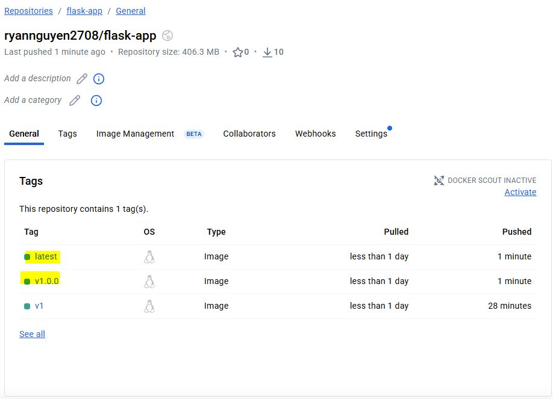
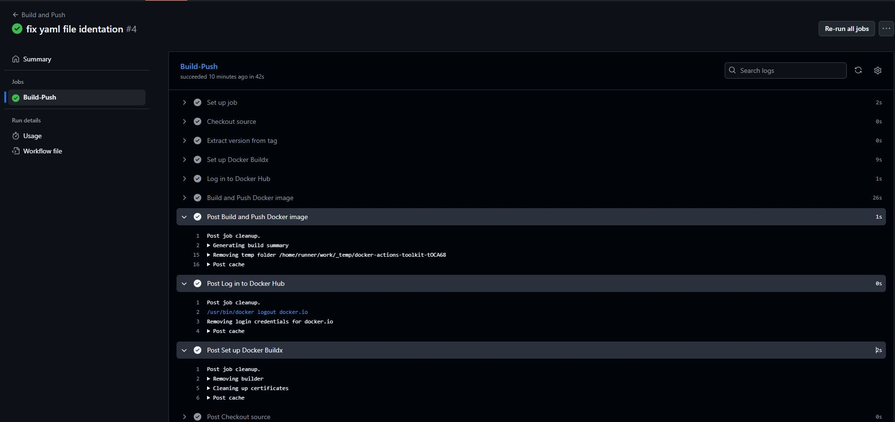

Module 3.3 Intro to Containerization

1. Docker image will be built base on the tag version of the commit.

2. CI will be skipt if commit message contains string [skip ci]

3. Docker Hub Repo after image built and push from github actions

4. Github Actions Details
